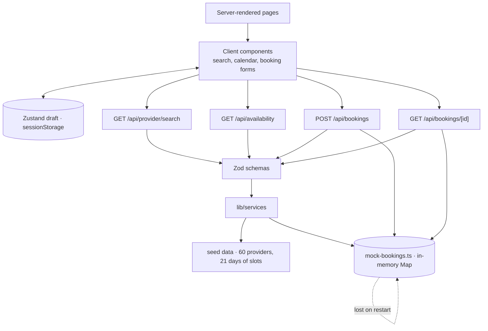

# LocalServe

Find local professionals, compare them, and book an appointment without phoning around. A Next.js marketplace demo: search by service and location, filter and sort results, read a provider profile, pick a real time slot, and complete a guided booking wizard.

## 1. Problem

Hiring a local professional is still a phone call and a chain of "do you know anyone who…". Ratings, services and service areas are scattered, so two providers are hard to compare; directories rarely show when someone is actually free, so you chase slots by phone; and nothing is shareable, so a good find cannot be sent to a friend or bookmarked.

## 2. Solution

One flow: **search** by service and location → **filter and sort** by category, rating, availability and price → **read a profile** with services, area and reviews → **pick a real slot** from a live availability feed → **book** through a validated wizard. Search state lives in the URL, so a filtered list is shareable, bookmarkable, and restored by the Back button.

## 3. Demo link and setup

**Live demo:** _(not published)_ · Local: `http://localhost:3000`

```bash
npm install
cp .env.example .env.local   # NEXT_PUBLIC_API_URL=http://localhost:3000/api
npm run dev
```

`npm run dev|build|start` · `typecheck` · `lint` · `test` (+ `test:watch`, `test:coverage`) · `test:e2e` (+ `test:e2e:ui`, `test:e2e:report`).

## 4. Main features

**Discovery** — two-field home search with suggestion popovers; service directory and per-category pages; filters for category, rating and availability; sorting and pagination (6 per page); all state in query parameters.

**Provider profiles** — name, headline, rating, review count, about, services, service area, an availability preview, reviews, and `LocalBusiness` JSON-LD.

**Booking** — four steps (service → date & time → details → review); unavailable calendar days are `aria-disabled` and unselectable; availability is re-checked at submit and a taken slot returns **409**; conflict recovery preserves the customer's details and returns them to the calendar; confirmation with an opaque booking ID. **Cross-cutting** — Zod validation at every API and form boundary; metadata, sitemap and robots; Jest and Playwright suites.

## 5. Technology and important choices

| Layer      | Choice                                          | Why                                                                                 |
| ---------- | ----------------------------------------------- | ----------------------------------------------------------------------------------- |
| Framework  | **Next.js 16.3.5** App Router, **React 19.2.8** | Server Components, route handlers, per-page metadata, file-based SEO routes         |
| Language   | **TypeScript 5** (`strict`)                     | One data model shared across routes, services and forms                             |
| Styling    | **Tailwind CSS 4**                              | No runtime CSS-in-JS cost                                                           |
| Components | **HeroUI 3.2.5** + **lucide-react**             | Accessible calendar and select primitives themed via Tailwind; tree-shakeable icons |
| State      | **Zustand 5** + `persist`                       | No provider tree; `persist` handles `sessionStorage` cleanly                        |
| Validation | **Zod 4**                                       | One schema for route handlers _and_ forms, so they cannot drift                     |
| HTTP       | **axios**                                       | `baseURL` and timeout in one place (`lib/api/client.ts`)                            |
| Data       | **Generated seed data**                         | Zero-setup demo: 60 providers, 21 days of slots                                     |
| Tests      | **Jest 30 + RTL** / **Playwright 1.63**         | Fast unit feedback, real-browser journeys                                           |

## 6. Route / information architecture

```text
/                                       Landing + search
├── /services · /services/[serviceSlug] Category directory + category page
├── /search                             Results (filters, sort, pagination)
├── /providers/[providerSlug]           Public profile
├── /about · /faq                       Static marketing
├── /book/[providerId]                  Steps 1–2: service, date & time
│   ├── /details                        Step 3: customer details
│   └── /review                         Step 4: review + submit
└── /booking/confirmation/[bookingId]   Confirmation
```

API: `GET /api/provider/search` (filter, sort, paginate) · `GET /api/availability` (slots for a provider / date / service) · `POST /api/bookings` (validate and create) · `GET /api/bookings/[bookingId]` (look one up for confirmation).

**Two identifier strategies, on purpose.** Profiles use a readable slug (`/providers/solar-tech-pro`) because links get shared; booking and availability use the internal ID (`/book/pro-12`) because those operations need a stable key. `getProviderBySlug()` resolves one to the other. **Route groups.** Marketing pages share a header and footer in `(marketing)` without forcing a `/marketing` prefix into URLs; the wizard is separate because it needs a different shell — no site chrome, a progress bar, `noindex`.

## 7. Server vs Client Component decisions

Every page is a Server Component by default; a file only ships JavaScript by opting in with `"use client"`. Treated as a budget, not an accident.

**Server** — all layouts; home, services, about, FAQ; provider profiles (content, `generateMetadata` and JSON-LD all run server-side); `sitemap.ts` / `robots.ts`; and the presentational profile sections (`ProviderHeader`, `ProviderAbout`, `ProviderServices`, `ProviderServiceArea`, `ProviderReviews`), which take props only.

**Client — 10 files**, each forced by a concrete need: `home/HomeSearch` (inputs, popover, `router.push`); `search/SearchHeader`, `SearchFilters` and `Pagination` (query string); `search/SearchResults` (fetch on filter change); `ui/Calendar` (selection, keyboard); `booking/BookingDateTime` (fetches availability); `BookingDetails` (form state); `BookingReview` (submission, conflicts); `BookingConfirmation` (`sessionStorage` + API fallback).

**Rules applied.** Push the boundary _down_, not up — `ProviderAvailability` is a client component taking a plain `providerId` string, so the profile page above it still renders on the server. A server component can render a client one, never the reverse, hence serialisable props and clients fetching their own data when needed. `params` / `searchParams` are Promises in Next 16 and must be awaited. Metadata stays server-side so a crawler gets real HTML without running JS, and state lives in the URL or Zustand, never in a server component. **Result:** reading the home page or a profile executes essentially no application JavaScript.

## 8. Caching / freshness strategy

Rule: **cache what cannot change mid-session; never cache what the user is about to act on.**

| Data                        | Policy                 | Where                                         |
| --------------------------- | ---------------------- | --------------------------------------------- |
| Profiles, services, reviews | Build-time static      | Server components read seed data              |
| Search results              | Live per request       | `GET /api/provider/search`                    |
| Availability                | **`no-store`**         | `app/api/availability/route.ts:31`            |
| Availability (browser)      | Opts out of HTTP cache | `lib/api/availability.ts:25` sends `no-cache` |
| Booking draft               | Session-scoped         | Zustand `persist` → `sessionStorage`          |

**Why `no-store` for availability.** A slot can be taken while the customer is on the calendar, so a cached list would let them pick a time that no longer exists and the failure would only surface at submit — more API calls, but the slot shown is the slot bookable. Asserted in `test/unit/api-endpoints.test.ts`. **Why `sessionStorage`, not `localStorage`.** The draft holds customer details (name, phone, email, address); session storage clears on tab close, limiting how long it sits on a shared machine, and is tab-scoped so two tabs cannot fight over one draft. **The client is never trusted** — the draft is a convenience, not a source of truth, so `POST /api/bookings` re-validates with Zod and re-checks the slot against both seed availability and the store before writing; a tampered request gets a `400` or `409`.

## 9. Architecture diagram



**Read** — opening `/` or a profile reads seed data directly in a Server Component and ships no content JavaScript. **Search** — the home form writes `?service=&location=`; the handler parses with Zod, calls `searchProviders()` and returns 6 results, with the URL as the state. **Book** — the client checks availability when the calendar loads, but the **server re-checks at the moment of writing**, the only point where being right matters; a taken slot returns 409 and the user picks another time with their details intact.

## 10. ADR summary

Full rationale in [architecture-retrospective.md](docs/architecture-retrospective.md).

| #   | Decision                               | Why                                                | Trade-off                                                          |
| --- | -------------------------------------- | -------------------------------------------------- | ------------------------------------------------------------------ |
| 1   | Search state in the URL                | Shareable, bookmarkable, Back/Forward work free    | Query strings need validation and defaults                         |
| 2   | Slugs for profiles, IDs for operations | Shareable URLs; stable lookup keys                 | Slugs must be unique and resolved                                  |
| 3   | Server by default, client opt-in       | Public pages ship near-zero JS                     | Boundaries need care; data fetching sometimes moves client-side    |
| 4   | Draft in Zustand + session storage     | Survives four pages without input loss             | Not durable, not cross-tab, never a source of truth                |
| 5   | Availability never cached              | Stale slots cause phantom bookings                 | More requests than a cached endpoint                               |
| 6   | Zod schemas shared client/server       | The two sides cannot drift                         | Schemas add client bundle weight                                   |
| 7   | Seed data behind `lib/services`        | Swapping in a database touches one folder          | Indirection in a demo with no database                             |
| 8   | Bookings in a `globalThis` map         | Real 409 conflict detection with no infrastructure | Not durable, no atomic lock; forced a fresh dev server per E2E run |

## 11. SEO approach

`lib/seo.ts` exports `buildMetadata()`, applied everywhere: title template `{title} | LocalServe`, description, canonical, robots, and matching Open Graph / Twitter cards. `clampDescription()` truncates at 160 characters on a word boundary so descriptions never break mid-word. Marketing pages use a static `metadata` export; `/services/[serviceSlug]` and `/providers/[providerSlug]` generate per-entity metadata via `generateMetadata` (provider pages add rating, review count, services and area). `/search` is `index: false` — a results page is not a landing page — and `/book/**` with `/booking/**` are `noindex, nofollow`, set in the booking layout.

**Structured data** — provider pages embed `LocalBusiness` JSON-LD with `name`, `description`, `url`, `image`, `areaServed`, `PostalAddress` and `AggregateRating`, escaping `<` as `\u003c` so a seed string cannot close the script tag. **Crawl files** — `app/sitemap.ts` emits the four marketing routes (priority 1 → 0.5), every category (0.7) and all 60 providers (0.9); `app/robots.ts` allows everything except `/api/`, `/book/`, `/booking/`, `/search`. **Not yet verified** — helpers and crawl rules are unit tested, but a production build's rendered output has not been inspected end to end.

## 12. Performance case study

**There is no Lighthouse report or bundle budget in this repository.** The test plan records this as a gap, so this section reports what was actually done rather than inventing numbers.

_Helps:_ server rendering for all marketing and profile content (HTML, not JS, for a provider's name and reviews) · 10 client components out of ~60 · build-time prerendering of the four marketing pages · seed data read directly by server components, so no database round trip on the public path · 6 results per page bounds the response · tree-shakeable icons, no CSS-in-JS. _Costs:_ `lib/data/seed/generate.ts` builds 60 providers with services, reviews and 21 days of slots at import time — once per server process, but real CPU work on boot and every dev reload · HeroUI and the React Aria stack are a genuine dependency weight behind the calendar and select primitives, not currently split into dynamic imports · `axios` for four endpoints where `fetch` would do. _Before claiming any of it:_ record a Lighthouse baseline for `/` and a profile, record First Load JS from `next build`, and fail the build on regression.

## 13. Accessibility approach

Semantic HTML first — real `<main>`, `<nav>`, `<section>`, `<form>`, `<button>`. Native controls before ARIA, and visible focus is never removed without a replacement. Colour comes from HeroUI theme tokens (`bg-background`, `text-text-secondary`, `text-brand-700`) rather than ad-hoc hex, keeping contrast decisions in one place.

Fixed during QA ([bug reports](docs/bug-reports.md)): the service and location inputs shared one accessible name and are now distinct and tested · calendar days announce a full date rather than a bare number · unavailable days are `aria-disabled`, skipped by keyboard and unselectable · the booking form is tested through its labels, not CSS selectors. **Honest status** — that is a handful of targeted assertions, not an audit: no axe run, no screen-reader pass, no contrast check, no measured tap targets at 390px. A full WCAG audit is future work, not a claim.

## 14. Testing strategy

| Layer       | Tool                                 | Covers                                                                               |
| ----------- | ------------------------------------ | ------------------------------------------------------------------------------------ |
| Static      | `tsc`, `eslint`, `next build`        | Types, lint, production build                                                        |
| Unit        | Jest — `test/unit/` (11)             | Services, schemas, formatters, API client and handlers, SEO helpers, in-memory store |
| Component   | Jest + RTL — `test/components/` (7)  | Search and filter UI, reviews, availability, rating stars, slot rendering            |
| Integration | Jest + RTL — `test/integration/` (2) | Two connected flows with mocked network: search results, booking date & time         |
| E2E         | Playwright — 2 specs, 4 tests        | The real booking journey; two-customer slot-conflict recovery                        |
| Manual      | [43 cases](docs/test-cases.md)       | Navigation, filters, profiles, failure states, responsive widths, a11y, SEO          |

Recorded results: 20 Jest suites / 162 tests passing, clean typecheck, lint and build ([qa-report.md](docs/qa-report.md)). `e2e/slot-conflict.spec.ts` is the highest-value spec here — it found a real cross-page bug (`BUG-004`, "Choose Another Time" discarded the chosen service).

## 15. Known limitations

**Data** — bookings live in a `globalThis` map, so they are lost on restart and not shared between instances; there is no atomic slot lock, so concurrent requests can still race; no database, everything is generated seed data. **Scope** — no authentication or accounts; no payments; no provider-side tooling to manage a profile or availability. **Quality** — Chromium only (Firefox and WebKit not installed, so cross-browser behaviour is unassessed); no mobile E2E journey; no accessibility audit; no performance baseline. **SEO** — rendered metadata unverified on a production build; no Search Console or analytics. **Technical debt** — `e2e/_tmp-overflow.spec.ts` should be deleted or promoted · `.env.example` is missing the `/api` suffix on `NEXT_PUBLIC_API_URL` · two Hero elements are commented out in `components/home/Hero.tsx`.
